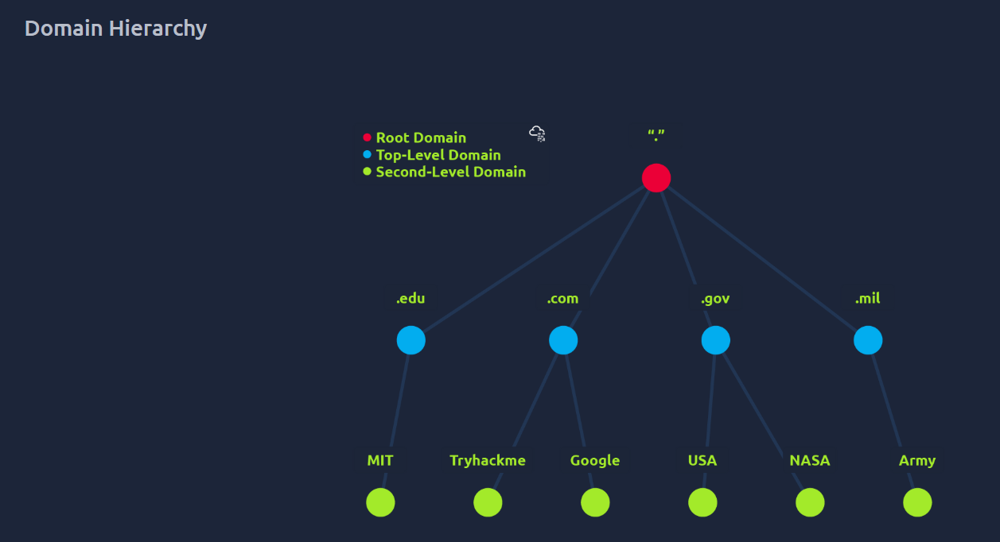

# 🌍 DNS (Domain Name System)

DNS provides a simple way to communicate with devices on the internet without remembering complex IP addresses.  
Instead of remembering `104.26.10.229`, you can just type `tryhackme.com`.

---

## 🏷 Domain Hierarchy

- **TLD (Top Level Domain)** → The right-most part of a domain.  
  - Example: `tryhackme.com` → `.com`  
  - Types:  
    - **gTLD (Generic)** → `.com`, `.org`, `.edu`, `.gov`  
    - **ccTLD (Country Code)** → `.in`, `.uk`, `.ca`  

- **Second-Level Domain (SLD)** → Appears before the TLD.  
  - Example: `tryhackme` in `tryhackme.com`  

- **Subdomain** → Placed before the SLD.  
  - Example: `admin` in `admin.tryhackme.com`

---

✅ **Summary**:  
- DNS = maps domain names → IP addresses  
- Domain hierarchy = TLD → SLD → Subdomain

---

# DNS Records  

DNS isn’t just for websites — multiple record types exist.  

---

### 🔹 Common DNS Record Types  

- **A Record**  
  Maps a domain to an **IPv4 address**.  
  Example: `104.26.10.229`  

- **AAAA Record**  
  Maps a domain to an **IPv6 address**.  
  Example: `2606:4700:20::681a:be5`  

- **CNAME Record**  
  Alias of another domain.  
  Example: `store.tryhackme.com → shops.shopify.com`  

- **MX Record**  
  Specifies **mail servers** for a domain, with priority for failover.  
  Example: `alt1.aspmx.l.google.com`  

- **TXT Record**  
  Free text data.  
  Common uses:  
  - Email security (SPF, DKIM)  
  - Domain ownership verification  

---

📌 These records are the backbone of how domains resolve to IPs, mail servers, and services.

