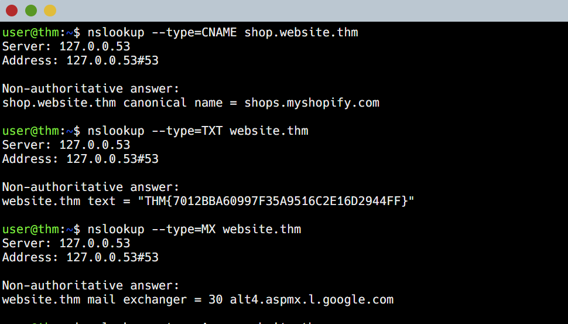

# TryHackMe: DNS in Detail

**Room Link:** [DNS in Detail - TryHackMe](https://tryhackme.com/room/dnsindetail)  
**Difficulty:** Easy  
**Category:** Pre-Security  
**Completion Date:** Sept 8, 2025

---

## Overview

This room helped me understand how the Domain Name System (DNS) works. It covered the role of different record types, domain hierarchy, and how DNS queries are executed from client to server.

---

## Key Learnings

- **Purpose of DNS:** Converts domain names into IP addresses so that computers can communicate.
- **Domain Structure:** Organized as Root → Top-Level Domain → Domain → Subdomain.
- **Important Record Types:**
  - **A Record:** Links a domain or subdomain to an IP address.
  - **CNAME Record:** Points an alias domain to another domain.
  - **MX Record:** Specifies mail servers with priority.
  - **TXT Record:** Used for verification, such as flags or domain ownership.
- **Tools Practiced:** `nslookup` and `dig` for querying DNS records.

---

## DNS Records for website.thm

| Record Type        | Value                                 |
| ------------------ | ------------------------------------- |
| CNAME (shop)       | shops.myshopify.com                   |
| TXT Record         | THM{7012BBA60997F35A9516C2E16D2944FF} |
| MX Record Priority | 30                                    |
| A Record (www)     | 10.10.10.10                           |

---

## Commands and Output


### Query A record for main website

```bash
nslookup www.website.thm
dig www.website.thm A
```

## Completion Proof



