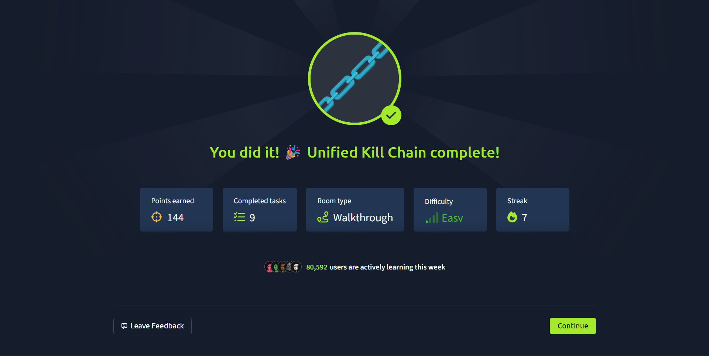
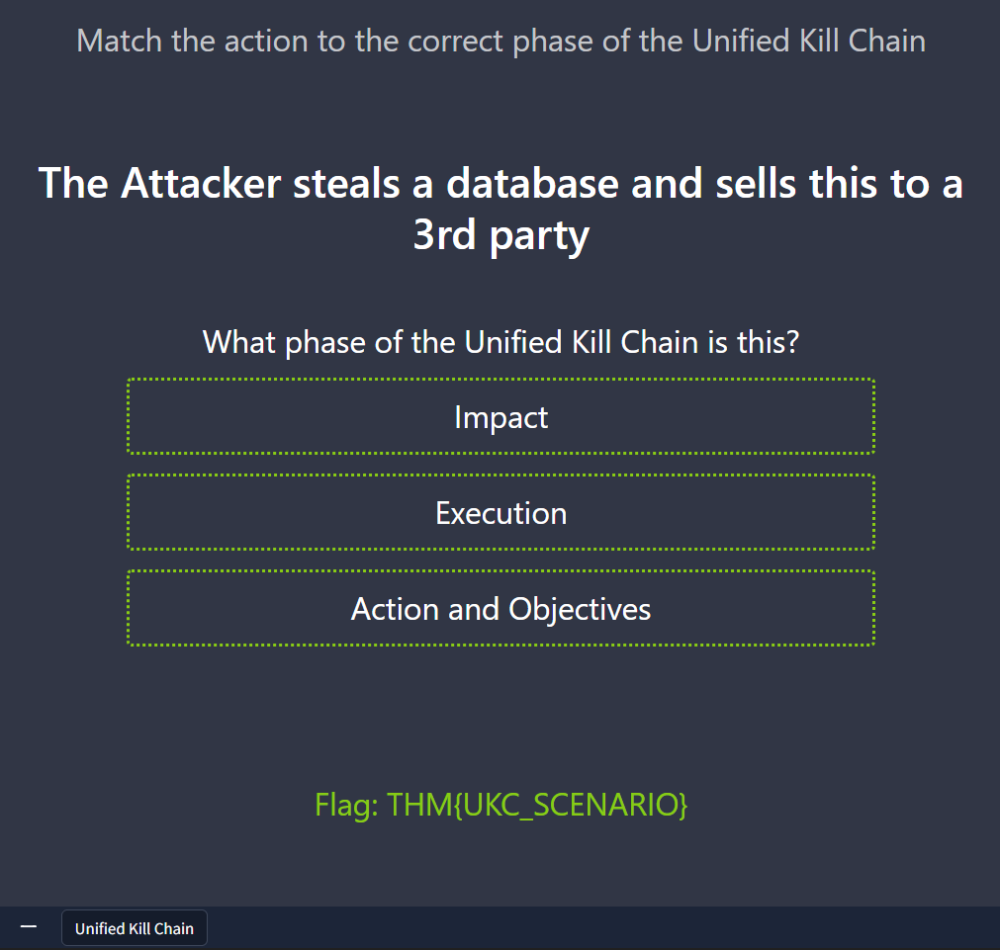

# Unified Kill Chain — TryHackMe

- **Platform:** TryHackMe
- **Room:** Unified Kill Chain
- **Status:** ✅ Completed
- **Date:** 2025-09-14

## Focus Areas

- Reconnaissance
- Initial Access
- Privilege Escalation
- Lateral Movement
- Exfiltration

## Key Takeaways

- Importance of thorough reconnaissance to reduce noisy guesses.
- How privilege escalation paths differ by OS and service misconfigurations.
- Effective pivoting requires persistent footholds + credential harvesting.
- Detection strategies: correlate unusual SMB/SSH sessions, unexpected base64 uploads, and privilege escalation logs.

## Screenshots

